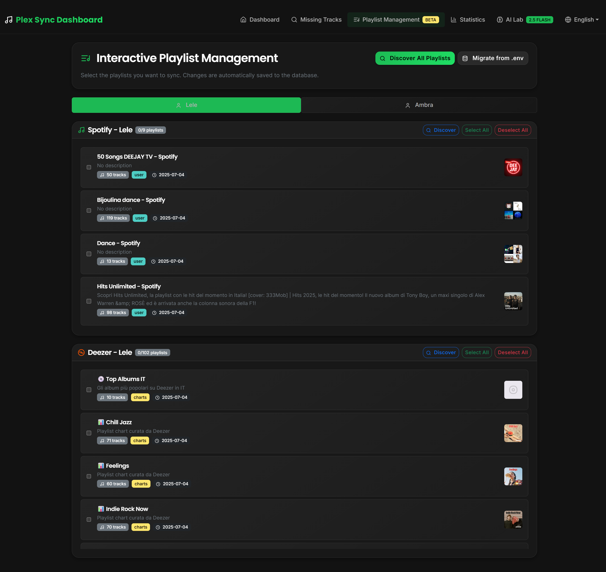

# Plex Sync & Completer


A comprehensive Python application, executed via Docker, that keeps your Plex music library synchronized with streaming services like Spotify and Deezer. Features an interactive web-based playlist management system, automatic missing track downloads, AI-generated playlists with Google Gemini, and complete automation with manual control options.

## 📋 Table of Contents

- [✨ Key Features](#-key-features)
- [🆕 What's New](#-whats-new)
- [🚀 Quick Start](#-quick-start)
- [🎛️ Interactive Playlist Management](#️-interactive-playlist-management)
- [🔧 Installation Methods](#-installation-methods)
  - [Docker Compose (Recommended)](#-docker-compose-recommended)
  - [Platform-Specific Installations](#platform-specific-installations)
- [⚙️ Configuration](#️-configuration)
  - [Environment Variables](#environment-variables-env)
- [🖥️ Web Interface](#️-web-interface)
- [🌐 Internationalization](#-internationalization)
- [🔧 Troubleshooting](#-troubleshooting)
- [📸 Screenshots](#-screenshots)

## ✨ Key Features

- **🎵 Multi-Platform Synchronization**: Automatically syncs playlists from **Spotify** and **Deezer** to your Plex library
- **🎛️ Interactive Playlist Management**: NEW! Web-based interface for discovering, selecting, and managing playlists with real-time statistics
- **🆕 Plex Playlist Manager**: NEW! Dedicated interface for enhancing existing Plex playlists with AI-generated covers and descriptions
- **🔍 Enhanced Universal Search**: Intelligent search across Spotify and Deezer with consistent library status detection
- **🧹 Smart URL Processing**: Automatic cleaning of URLs with invisible Unicode character removal
- **👥 Multi-User Management**: Supports multiple Plex users with individual configurations and playlists
- **🔗 Playlist Sharing System**: Share playlists between users with independent selection control and physical copy architecture
- **📎 Manual Playlist Addition**: Add any public Spotify playlist directly via URL or ID through the web interface
- **🤖 AI Playlist Generation**: Uses **Google Gemini** with **Ollama fallback** to create personalized weekly playlists and refresh existing AI playlists
- **📊 Smart Missing Track Detection**: Identifies songs missing from your library with advanced matching algorithms and auto-sync capabilities
- **⬇️ Robust Download System**: Enhanced streamrip integration with comprehensive error handling and Spotify-to-Deezer conversion
- **🗑️ Automated Cleanup**: Removes old playlists while preserving important ones with protection tags
- **⏰ Background Processing**: Runs continuously with configurable sync intervals or manual operation
- **📈 Rich Statistics**: Real-time dashboard with detailed music library analytics
- **🌍 Multilingual Interface**: Complete English/Italian support with automatic language detection
- **💾 Database-Driven Configuration**: Modern database storage with migration from environment variables

## 🆕 What's New

### ⚡ Latest Improvements (July 2025)
- **🎨 AI PLAYLIST COVER GENERATION**: Revolutionary SwarmUI integration with Fluxmania Legacy model for professional-quality covers with perfect text rendering and 40+ genre-specific styles
- **🎵 UNIFIED MUSIC DIRECTORY SETUP**: Revolutionary simplified configuration - only change TWO things to set up music downloads for any OS (Windows/Linux/macOS/NAS)
- **🆕 PLEX PLAYLIST MANAGER**: Brand new dedicated interface for managing existing Plex playlists with AI cover generation, description creation, and bidirectional sync capabilities
- **🔧 Direct Download Fixes**: Fixed JavaScript errors in download functionality and URL handling
- **🧹 Unicode Character Cleaning**: Automatically removes invisible Unicode characters from URLs (frontend + backend)
- **📚 Consistent Library Checking**: Spotify and Deezer search results now show accurate "In Libreria" status
- **🎯 Enhanced URL Conversion**: Improved Spotify-to-Deezer URL conversion with comprehensive error handling
- **🔍 Smart Search Interface**: Removed unused "Plex" tab from search results for cleaner interface
- **🛡️ Robust Error Handling**: Enhanced error logging and fallback strategies for failed operations
- **🚀 Auto-Sync Integration**: Library checking now includes auto-sync functionality for real-time updates

### 🔄 Real-Time Interface Synchronization
- **Live Badge Updates**: All statistics badges update instantly without page refresh
- **Database Synchronization**: Interface elements sync directly with database state
- **Smart Checkbox Management**: Checkbox states automatically reflect actual database selections
- **Global Counter Updates**: Total playlist count updates in real-time across all sections
- **Physical Copy System**: Enhanced playlist sharing with independent selection states per user
- **Instant Feedback**: All playlist selections show immediate visual confirmation

### 🔗 Advanced Playlist Management
- **Playlist Sharing System**: Share playlists between main and secondary users with independent control
- **Manual Spotify Playlist Addition**: Add any public Spotify playlist by URL or ID directly through the web interface
- **Physical Copy Architecture**: Each user maintains independent selection states for shared playlists
- **Cross-User Synchronization**: Shared playlists appear in both user sections with separate controls

### 🆕 Plex Playlist Manager - New Dedicated Interface
A completely new section that revolutionizes how you manage your existing Plex playlists:

#### 🎯 Core Functionality
- **Direct Plex Integration**: Import and manage playlists that already exist in your Plex Media Server
- **Bidirectional Sync**: Changes made in the interface sync directly back to Plex
- **Real-Time Updates**: Live synchronization between the web interface and your Plex server
- **Multi-User Support**: Separate management for main and secondary Plex users

#### 🤖 AI Enhancement Features
- **AI Cover Generation**: Create professional playlist covers using SwarmUI/ComfyUI with 40+ genre-specific styles
- **Smart Description Creation**: Generate engaging playlist descriptions using Google Gemini AI with multiple style options
- **Preview Before Apply**: See generated covers and descriptions before applying them to Plex
- **Selective Sync**: Choose to apply only covers, only descriptions, or both

#### 🎨 Interface Features
- **Playlist Cards**: Visual grid layout showing covers, metadata, and enhancement status
- **Smart Filtering**: Essential filters - "Tutte", "Con Cover AI", "Con Descrizioni AI", "Senza Cover"
- **Bulk Operations**: Generate covers or descriptions for multiple playlists simultaneously
- **Statistics Dashboard**: Real-time counters showing enhancement progress and playlist status

#### 🔄 How It Works
1. **Import from Plex**: Click "Refresh Playlists" to sync existing playlists from your Plex server
2. **Browse & Filter**: Use the visual interface to browse your playlists and filter by enhancement status
3. **Generate AI Content**: Create covers and descriptions for individual playlists or in bulk
4. **Preview & Apply**: Review AI-generated content before applying it to your Plex server
5. **Track Progress**: Monitor enhancement status with real-time statistics and visual indicators

### 🎛️ Interactive Web Interface
- **Web-Based Discovery**: Automatically discover playlists from Spotify and Deezer with one-click
- **Curated Content Access**: Access to Deezer charts, genres, radio stations, and editorial playlists
- **Real-Time Statistics**: Live track counts and selection feedback in the interface
- **Database-Driven**: Modern database storage with migration from legacy environment variables
- **Bulk Operations**: Select/deselect all playlists with instant visual feedback
- **Multi-User Support**: Separate playlist management for main and secondary users
- **Visual Interface**: Playlist cards with covers, metadata, and type indicators

### 🤖 Enhanced AI Features
- **SwarmUI Integration**: Revolutionary AI cover generation using SwarmUI with Fluxmania Legacy model for professional-quality covers
- **Advanced Text Generation**: AI-generated covers with perfect text rendering and genre-specific styling (40+ music genres)
- **Automatic Updates**: AI-generated playlists now automatically refresh with new content from your library
- **Smart Regeneration**: Maintains original theme while adding fresh tracks
- **Dual AI System**: Google Gemini with Ollama local fallback for unlimited AI playlist generation
- **Weekly Management**: Weekly AI playlists are separately managed with their own persistence system
- **AI Cover Pipeline**: SwarmUI → ComfyUI → Simple covers fallback system with automatic capability detection

### 🔧 Technical Improvements
- **Unified Library Checking**: Both Spotify and Deezer search results now use the same `check_album_in_library()` and `check_track_in_index_smart()` functions
- **Advanced URL Sanitization**: Frontend JavaScript and backend Python both clean URLs with regex patterns for invisible Unicode characters
- **Enhanced Error Logging**: Comprehensive debug information for URL conversion, library checking, and download processes
- **Auto-Sync Database Integration**: Real-time library updates when content is found in Plex but missing from database
- **Fallback Download Strategies**: Multiple retry mechanisms and conversion strategies when primary methods fail
- **Streamlined Search Interface**: Removed redundant UI elements and optimized search result display

## 🚀 Quick Start

This section provides step-by-step instructions for beginners to get the system running with minimal configuration.

### Prerequisites

Before starting, ensure you have:

- ✅ **Docker Desktop** installed ([Download here](https://www.docker.com/products/docker-desktop/))
- ✅ **Plex Media Server** running and accessible ([Setup guide](https://support.plex.tv/articles/200288896-basic-setup/))
- ✅ A **music library** already configured in Plex
- ✅ Basic knowledge of your system's file paths

### Step 1: Get Required API Credentials

You'll need to obtain several API keys and tokens:

#### 🎵 Spotify API (Required for Spotify sync)
1. Go to [Spotify for Developers](https://developer.spotify.com/dashboard)
2. Click "Create App"
3. Fill in app name and description (any values work)
4. Note down your **Client ID** and **Client Secret**
5. Open your [Spotify Profile](https://open.spotify.com/) and copy the user ID from the URL

#### 🎧 Deezer ARL (Required for downloads)
1. Log into [Deezer](https://www.deezer.com) in your browser
2. Open Developer Tools (F12)
3. Go to **Application** > **Cookies** > **deezer.com**
4. Find the cookie named `arl` and copy its value
5. **Important**: This token expires every few months and needs renewal

#### 🤖 Google Gemini API (Required for AI playlists)
1. Visit [Google AI Studio](https://aistudio.google.com/)
2. Click "Get API Key" and create a new project
3. Generate and copy your API key

#### 🎨 SwarmUI (Optional for AI cover generation)
**SwarmUI** is the preferred AI system for generating professional playlist covers with text.

**Setup SwarmUI:**
1. Install SwarmUI: [https://github.com/Stability-AI/StabilityMatrix](https://github.com/Stability-AI/StabilityMatrix)
2. Download Fluxmania Legacy model from [Civitai](https://civitai.com/models/778691)
3. Configure SwarmUI with:
   - **Model**: Fluxmania Legacy
   - **Sampler**: dpmpp_2m
   - **Scheduler**: sgm_uniform
   - **Steps**: 25
   - **Guidance**: 3.5
4. Start SwarmUI on port 7801
5. Configure in `.env`:
   ```bash
   SWARMUI_URL=http://localhost:7801
   SWARMUI_MODEL=Fluxmania_Legacy.safetensors
   SWARMUI_STEPS=25
   SWARMUI_GUIDANCE=3.5
   SWARMUI_CFG_SCALE=3.5
   SWARMUI_SAMPLER=dpmpp_2m
   SWARMUI_SCHEDULER=sgm_uniform
   ```

**Benefits:**
- ✅ Professional-quality covers
- ✅ Perfect text rendering
- ✅ 40+ genre-specific styles
- ✅ Automatic fallback to ComfyUI/Simple covers

#### 🤖 Ollama AI (Optional fallback for AI playlists)
**Ollama** serves as a local AI fallback when Gemini reaches rate limits or is unavailable.

**Setup Ollama:**
1. Install Ollama: [https://ollama.ai](https://ollama.ai)
2. Pull a compatible model:
   ```bash
   ollama pull hermes3:8b
   # or
   ollama pull llama3.1:8b
   ```
3. Verify it's running:
   ```bash
   ollama list
   ```
4. Configure in `.env`:
   ```bash
   OLLAMA_URL=http://localhost:11434
   OLLAMA_MODEL=hermes3:8b
   ```

**Benefits:**
- ✅ No API rate limits
- ✅ Works offline
- ✅ Free to use
- ✅ Automatic fallback when Gemini fails

#### 🎬 Plex Token (Required)
1. Open Plex in your browser
2. Go to **Settings** > **Account** > **Privacy**
3. Click "Show" next to "Plex Token" and copy the value

### Step 2: Download and Configure Files

#### Download Required Files
```bash
# Create project directory
mkdir plex-completer
cd plex-completer

# Download the example files (you'll need to get these from the repository)
# .env.example
# config.example.toml
# docker-compose.yml
```

#### Create Your Configuration Files

**📝 Create `.env` file** (copy from `.env.example`):
```bash
cp .env.example .env
```

Edit `.env` with your favorite text editor and fill in these **REQUIRED** values:
```bash
# Plex Configuration (REQUIRED)
PLEX_URL=http://your-plex-server-ip:32400
PLEX_TOKEN=your_plex_token_here
LIBRARY_NAME=Music

# Spotify Configuration (REQUIRED for Spotify sync)
SPOTIFY_CLIENT_ID=your_spotify_client_id
SPOTIFY_CLIENT_SECRET=your_spotify_client_secret

# AI Configuration (REQUIRED for AI playlists)
GEMINI_API_KEY=your_gemini_api_key

# Deezer Configuration (REQUIRED for downloads)
DEEZER_ARL=your_deezer_arl_cookie

# Basic Settings
PUID=1000
PGID=1000
```

**📝 Create `config.toml` file** (copy from `config.example.toml`):
```bash
cp config.example.toml config.toml
```

The main setting to configure in `config.toml`:
```toml
[deezer]
arl = "your_deezer_arl_cookie_here"
```

### Step 3: 🎵 Configure Music Directory (Simple 2-Step Setup)

**🎯 You only need to change TWO things to configure where your music downloads are saved:**

#### Step 3.1: Set Download Path in `.env`
```bash
# Add this line to your .env file
MUSIC_DOWNLOAD_PATH="/music"
```
> **Note**: Keep this as `/music` - this is the path inside the Docker container

#### Step 3.2: Map Your Music Library in `docker-compose.yml`

Edit the volume mount to point to YOUR music library:

**🪟 Windows Users:**
```yaml
volumes:
  - M:/organizzata:/music           # Replace with your music folder path
  - ./state_data:/app/state_data
```

**🐧 Linux Users:**
```yaml
volumes:
  - /home/username/Music:/music     # Replace with your music folder path
  - ./state_data:/app/state_data
```

**🍎 macOS Users:**
```yaml
volumes:
  - /Users/username/Music:/music    # Replace with your music folder path
  - ./state_data:/app/state_data
```

**🏠 NAS Users (Synology/QNAP):**
```yaml
volumes:
  - /volume1/music:/music           # Replace with your NAS music folder
  - ./state_data:/app/state_data
```

#### ✅ Complete Example for Windows:
```yaml
services:
  completer:
    image: lelus78/plex-library-completer:latest
    container_name: plex-library-completer
    env_file:
      - .env
    ports:
      - "5000:5000"
    volumes:
      - D:/My Music Library:/music  # 👈 Your actual music folder
      - ./state_data:/app/state_data
      - ./config.toml:/root/.config/streamrip/config.toml
      - ./.env:/app/.env
    environment:
      - PUID=1000
      - PGID=1000
    restart: unless-stopped
```

> **🔧 That's it!** The system automatically configures streamrip and all other components based on these two settings. No need to edit multiple config files!

### Step 4: Launch the Application

```bash
# Start the container
docker-compose up -d

# Check if it's running
docker-compose logs -f
```

### Step 5: Access the Web Interface

Open your browser and go to:
- **Local**: `http://localhost:5000`
- **Network**: `http://[your-server-ip]:5000`

### Step 6: Initial Setup in Web Interface

1. **Index Your Library**: Click "Index Library" to scan your music collection
2. **Wait for Completion**: This may take 10-30 minutes depending on library size
3. **NEW! Interactive Playlist Management**: 
   - Navigate to "Gestione Playlist" (Playlist Management) in the top menu for Spotify/Deezer playlist discovery
   - Use the discovery buttons to automatically find playlists from Spotify and Deezer
   - Select the playlists you want to sync using the interactive interface
   - Alternatively, migrate existing playlist IDs from your `.env` file to the database
4. **NEW! Plex Playlist Manager**:
   - Navigate to "Playlist Plex" in the top menu to manage your existing Plex playlists
   - Click "Refresh Playlists" to import playlists from your Plex server
   - Generate AI covers and descriptions for your existing playlists
   - Use bulk operations to enhance multiple playlists at once
5. **Test Sync**: Click "Start Full Sync" to test the synchronization

### Quick Test Configuration

For testing purposes, you can use this minimal `.env` configuration:

```bash
# Minimal test configuration
PLEX_URL=http://192.168.1.100:32400
PLEX_TOKEN=your_plex_token
LIBRARY_NAME=Music
SPOTIFY_CLIENT_ID=your_spotify_id
SPOTIFY_CLIENT_SECRET=your_spotify_secret

# Optional for full functionality
GEMINI_API_KEY=your_gemini_key
DEEZER_ARL=your_deezer_arl

# Regional content (default: IT)
COUNTRY=US

# Disable features for testing
SKIP_SPOTIFY_SYNC=0
SKIP_DEEZER_SYNC=0
RUN_DOWNLOADER=0
RUN_GEMINI_PLAYLIST_CREATION=0
TEST_MODE_RUN_ONCE=1
```

## 📋 Required Files Checklist

Before running, ensure you have created these files:

- [ ] `.env` (from `.env.example` with your credentials)
- [ ] `config.toml` (from `config.example.toml` with your Deezer ARL)
- [ ] `docker-compose.yml` (with correct volume paths)
- [ ] Created `state_data/` directory (will be created automatically)

## 🎛️ Interactive Playlist Management

The application features a comprehensive web-based playlist management system that replaces the need for manual playlist ID configuration.

### How to Use Playlist Management

1. **Access the Interface**: Navigate to "Gestione Playlist" in the top menu
2. **Discover Playlists**: Use the discovery buttons to automatically find content:
   - **Spotify**: Discover user playlists, featured playlists, and category content
   - **Deezer**: Access charts, genres, radio stations, and editorial playlists
3. **Select Playlists**: Use checkboxes to select which playlists to sync
4. **Real-Time Feedback**: See live statistics and track counts as you make selections
5. **Save Automatically**: All changes are saved to the database immediately

### Content Types Available

#### Spotify Content
- **User Playlists**: Your public and followed playlists
- **Featured Playlists**: Spotify's curated featured content
- **Category Playlists**: Content organized by music categories

#### Deezer Content  
- **Charts**: Official top tracks and albums by country
- **Genres**: Music categories with dynamic content
- **Radio Stations**: Curated streaming radio content
- **Editorial Playlists**: Deezer's curated playlist collections

### Migration from Environment Variables

If you have existing playlist IDs in your `.env` file:
1. Click the "Migra da .env" button in the playlist management interface
2. The system will automatically import your existing configurations
3. After migration, you can use the visual interface for all future changes

### Bulk Operations

- **Select All**: Quickly select all playlists for a service
- **Deselect All**: Clear all selections for a service  
- **Discover All**: Find playlists for all services and users at once

### Playlist Sharing Between Users

The application supports sharing playlists between main and secondary users:

1. **Share a Playlist**: Click the share dropdown button next to any playlist
2. **Select Target User**: Choose which user to share the playlist with
3. **Independent Control**: Each user can independently select/deselect shared playlists
4. **Visual Indicators**: Shared playlists show badges indicating their shared status
5. **Physical Copies**: Shared playlists create independent copies for each user

### Manual Playlist Addition

Add any public Spotify playlist manually:

1. **Get Playlist URL**: Copy any public Spotify playlist URL from the Spotify app or web player
2. **Access Add Function**: Use the "Add Public Playlist" feature in the Spotify sections
3. **Paste URL or ID**: Enter the full URL or just the playlist ID
4. **Automatic Import**: The system will fetch metadata and add it to your available playlists
5. **Immediate Selection**: The playlist becomes available for selection and sync

**Supported URL Formats:**
- `https://open.spotify.com/playlist/37i9dQZF1DXcBWIGoYBM5M`
- `spotify:playlist:37i9dQZF1DXcBWIGoYBM5M`
- `37i9dQZF1DXcBWIGoYBM5M` (just the ID)

### Benefits of the New System

- **🎯 No More Manual ID Hunting**: Automatically discover content without finding playlist IDs
- **🔄 Real-Time Updates**: See immediate feedback on your selections
- **📊 Track Count Visibility**: Know exactly how many tracks you're adding before syncing
- **🎨 Visual Interface**: Playlist covers and metadata make selection easier  
- **💾 Persistent Storage**: Settings saved in database, not just environment files
- **🚀 Curated Content Access**: Discover trending and editorial content you might miss otherwise
- **⚡ Instant Synchronization**: All interface elements update automatically without page refresh
- **🔄 Database-Driven Stats**: All counters and badges sync directly with database state
- **✅ Smart Visual Feedback**: Checkbox states automatically reflect actual database selections

## 🔧 Installation Methods

### 🐳 Docker Compose (Recommended)

The recommended installation method using the provided `docker-compose.yml`:

```bash
# Clone and setup
git clone <repository_url>
cd plex-library-completer
cp .env.example .env
cp config.example.toml config.toml

# Edit configuration files with your credentials
# Start the application
docker-compose up -d --build
```

### 🐳 Docker Run (Single Command)

For quick testing without docker-compose:

```bash
docker run -d \
  --name plex-library-completer \
  -p 5000:5000 \
  -v /path/to/your/music:/music \
  -v ./state_data:/app/state_data \
  -v ./config.toml:/root/.config/streamrip/config.toml \
  -v ./.env:/app/.env \
  -e PUID=1000 \
  -e PGID=1000 \
  --restart unless-stopped \
  lelus78/plex-library-completer:latest
```

## ⚙️ Configuration

### Understanding Configuration Files

The application uses two main configuration files:

### `.env.example` File
This file contains all the environment variables needed for the application. It includes:
- **Plex Server Configuration**: URL, tokens, and library settings
- **Streaming Service APIs**: Spotify and Deezer credentials
- **AI Integration**: Google Gemini API key
- **Operational Settings**: Sync intervals, cleanup rules, feature toggles

**Key sections in `.env.example`:**
```bash
# Plex Server Settings
PLEX_URL=http://your-plex-server:32400
PLEX_TOKEN=your_plex_token_here

# Streaming Services
SPOTIFY_CLIENT_ID=your_spotify_client_id
SPOTIFY_PLAYLIST_IDS=
DEEZER_PLAYLIST_ID=123456789,987654321

# AI Features
GEMINI_API_KEY=your_gemini_api_key
PLEX_FAVORITES_PLAYLIST_ID_MAIN=12345

# Operational Settings
SECONDS_TO_WAIT=86400
RUN_DOWNLOADER=1
RUN_GEMINI_PLAYLIST_CREATION=1
```

### `config.example.toml` File
This is the configuration file for `streamrip` (the download engine). The most important setting is:
```toml
[deezer]
arl = "your_deezer_arl_token_here"
```

**How to get your Deezer ARL:**
1. Log into Deezer in your browser
2. Open Developer Tools (F12)
3. Go to Application/Storage > Cookies
4. Find the `arl` cookie value
5. Copy this value to the config file

### Platform-Specific Installations

#### 🔧 Portainer Deployment

If you use Portainer for Docker management:

1. **Create New Stack**:
   - Go to Portainer → Stacks → Add Stack
   - Name it `plex-library-completer`

2. **Upload Configuration**:
   - Choose "Upload" method
   - Upload your `docker-compose.yml` file

3. **Environment Variables**:
   - Upload your `.env` file or manually add variables

4. **Deploy and Monitor**:
   - Click "Deploy the stack"
   - Monitor logs in Containers section

#### 🖥️ Unraid Installation

For Unraid users, here's a comprehensive step-by-step guide:

##### Prerequisites
- **Unraid Setup**: Ensure your Unraid server (version 6.9 or later) has Docker enabled and the Community Applications (CA) plugin installed
- **Plex Media Server**: A running Plex server on Unraid
- **API Keys**: Obtain required API credentials as per the Quick Start guide above

##### Step-by-Step Installation

**1. Add the Docker Container**

Since `lelus78/plex-library-completer` is not in Unraid's Community Applications store, add it manually:

1. Navigate to **Docker Tab** in Unraid WebGUI
2. Ensure Docker is enabled ("Enable Docker: Yes" in Settings > Docker)
3. Click **Add Container**
4. **Repository**: `lelus78/plex-library-completer:latest`
5. **Name**: `Plex-Library-Completer`
6. **Network Type**: Bridge (default)

**2. Configure Port Mappings**

Add port mapping for the web UI:
- **Name**: WebUI
- **Container Port**: 5000
- **Host Port**: 5000 (or another available port if 5000 is in use)
- **Connection Type**: TCP

**3. Configure Volume Mappings**

Add the following volume mappings:

**Config File:**
- **Name**: config
- **Container Path**: `/root/.config/streamrip/config.toml`
- **Host Path**: `/mnt/user/appdata/plex-library-completer/config.toml`
- **Access Mode**: Read/Write (rw)

**Music Library:**
- **Name**: music
- **Container Path**: `/music`
- **Host Path**: `/mnt/user/Media/Music` (adjust to your Plex music library path)
- **Access Mode**: Read/Write (rw)

**State Data:**
- **Name**: state_data
- **Container Path**: `/app/state_data`
- **Host Path**: `/mnt/user/appdata/plex-library-completer/state_data`
- **Access Mode**: Read/Write (rw)

**Environment Variables:**
- **Name**: env_file
- **Container Path**: `/app/.env`
- **Host Path**: `/mnt/user/appdata/plex-library-completer/.env`
- **Access Mode**: Read/Write (rw)

**4. Create Host Directories**

Use Unraid's terminal or File Manager:

```bash
# Create directories
mkdir -p /mnt/user/appdata/plex-library-completer/state_data
touch /mnt/user/appdata/plex-library-completer/config.toml
touch /mnt/user/appdata/plex-library-completer/.env

# Set permissions
chmod -R 777 /mnt/user/appdata/plex-library-completer
chown -R nobody:users /mnt/user/appdata/plex-library-completer
```

**5. Configure Environment Variables**

Add these key environment variables in the Unraid GUI:

- **PLEX_URL**: `http://<UNRAID_IP>:32400` (e.g., `http://192.168.1.100:32400`)
- **PLEX_TOKEN**: Your Plex authentication token
- **LIBRARY_NAME**: Exact name of your Plex music library (e.g., `Music`)
- **SPOTIFY_CLIENT_ID**: From Spotify for Developers (optional)
- **SPOTIFY_CLIENT_SECRET**: From Spotify for Developers (optional)
- **DEEZER_ARL**: Your Deezer ARL cookie (optional)
- **GEMINI_API_KEY**: From Google AI Studio (optional)
- **PUID**: `99` (Unraid's nobody user)
- **PGID**: `100` (Unraid's users group)

**6. Create Configuration Files**

**Create `.env` file:**
```bash
cd /mnt/user/appdata/plex-library-completer
nano .env
```

Copy your configuration from the Quick Start guide above, adjusting paths for Unraid:
```bash
PLEX_URL=http://192.168.1.100:32400
PLEX_TOKEN=your_plex_token_here
LIBRARY_NAME=Music
SPOTIFY_CLIENT_ID=your_spotify_client_id
SPOTIFY_CLIENT_SECRET=your_spotify_client_secret
DEEZER_ARL=your_deezer_arl_here
GEMINI_API_KEY=your_gemini_api_key
COUNTRY=IT
PUID=99
PGID=100
```

**Create `config.toml` file:**
```bash
nano config.toml
```

Basic configuration:
```toml
[deezer]
arl = "your_deezer_arl_here"

[downloads]
folder = "/music"
```

**7. Apply and Start**

1. Click **Apply** to create the container
2. Go to Docker tab, find **Plex-Library-Completer**, click **Start**
3. Enable **Autostart** for automatic startup with Unraid
4. Access web UI at `http://<UNRAID_IP>:5000`

**8. Verification and Troubleshooting**

**Check Logs:**
- Go to Docker tab > container icon > **Log** for errors

**Common Issues:**
- **Permission errors**: Re-run the chmod/chown commands above
- **Plex connection issues**: Verify PLEX_URL and PLEX_TOKEN
- **Web UI not accessible**: Check if port 5000 is available
- **Config errors**: Validate `.env` and `config.toml` syntax

**Performance Tips:**
- Move appdata share to cache SSD (Cache: Only in Shares settings)
- Use fast storage for music library access

**Test Functionality:**
1. Access web UI at `http://<UNRAID_IP>:5000`
2. Click "Index Library" to scan your music collection
3. Test playlist generation in AI Lab
4. Verify Spotify/Deezer sync if configured

##### Unraid-Specific Notes

- Use **nobody:users** (99:100) for container permissions
- Place config files in `/mnt/user/appdata/plex-library-completer/`
- Ensure music library path matches your Unraid shares
- Consider using cache drives for better performance
- Monitor container logs through Unraid's Docker interface

Thanks to [@pylorns](https://github.com/pylorns) for contributing this comprehensive Unraid installation guide!

#### 🔧 Build from Source (Development)

If you want to modify the code or build locally:

1.  **Clone the Repository**
    ```bash
    git clone <YOUR_PRIVATE_REPOSITORY_URL>
    cd Plex-Library-Completer
    ```

2.  **Configure Environment Variables**
    Copy and customize the environment file:
    ```bash
    cp .env.example .env
    ```
    Edit `.env` with your preferred text editor and fill in all the required values according to the Environment Variables table below.

3.  **Configure Deezer Downloads (Optional)**
    To enable automatic track downloads from Deezer, you have two options:
    
    **Option A: Environment Variable (Recommended for Docker)**
    Add your ARL cookie to the `.env` file:
    ```bash
    DEEZER_ARL=your_arl_cookie_here
    ```
    
    **Option B: Configuration File (Legacy method)**
    Copy and customize the streamrip configuration:
    ```bash
    cp config.example.toml config.toml
    ```
    Edit `config.toml` and add your Deezer ARL token.
    
    To find your Deezer ARL cookie, follow the instructions at:
    https://github.com/nathom/streamrip/wiki/Finding-your-Deezer-ARL-Cookie
    
    **Note**: If neither option is configured, the application will still work but will skip automatic downloads and only show links for manual download.

4.  **Verify Volume Paths**
    Edit `docker-compose.yml` and update the music library path:
    ```yaml
    volumes:
      - /path/to/your/music:/music # <-- Update this path
      # ... other volumes
    ```

#### Method 2: Portainer Installation

If you're using Portainer for Docker management:

1.  **Prepare Configuration Files**
    Create a folder on your server (e.g., `/opt/plex-completer/`) and place:
    - Your configured `.env` file (copied from `.env.example`)
    - Your configured `config.toml` file (copied from `config.example.toml`)
    - The `docker-compose.yml` file

2.  **Create Stack in Portainer**
    - Go to Portainer > Stacks > Add Stack
    - Choose "Upload" method
    - Upload your `docker-compose.yml` file
    - In the "Environment variables" section, either:
      - Upload your `.env` file, OR
      - Manually add each environment variable

3.  **Configure Volumes**
    In the docker-compose.yml, ensure paths are correct for your server:
    ```yaml
    volumes:
      - /opt/plex-completer/.env:/app/.env
      - /opt/plex-completer/config.toml:/root/.config/streamrip/config.toml
      - /path/to/your/music:/music
      - ./state_data:/app/state_data
    ```

4.  **Deploy Stack**
    - Review your configuration
    - Click "Deploy the stack"
    - Monitor logs in Portainer to ensure everything starts correctly

#### Method 3: Portainer with Git Repository

For easier updates:

1.  **Create Stack from Git**
    - Go to Portainer > Stacks > Add Stack
    - Choose "Repository" method
    - Enter your repository URL
    - Set the Compose path to `docker-compose.yml`

2.  **Environment Configuration**
    - In Portainer, add all environment variables manually, OR
    - Pre-place your `.env` file in the repository (not recommended for security)

3.  **Additional Configuration**
    - Ensure `config.toml` is accessible to the container
    - Set up volume mappings for your music library

## 🖥️ Cross-Platform Setup

Volume paths vary by host system. After copying `.env.example` and `config.example.toml`
to their real names, mount them so the container can read them. Both `app.py` and
`plex_playlist_sync/sync_logic.py` look for `/app/.env`.

### Linux
```yaml
volumes:
  - /home/youruser/Music:/music
  - ./config.toml:/root/.config/streamrip/config.toml
  - ./state_data:/app/state_data
  - ./your.env:/app/.env
```

### Windows (Docker Desktop)
Use the Docker Desktop path style.
```yaml
volumes:
  - /c/Users/YourUser/Music:/music
  - ./config.toml:/root/.config/streamrip/config.toml
  - ./state_data:/app/state_data
  - ./your.env:/app/.env
```

### NAS Share
Mount the share on the host and reference the mount point.
```yaml
volumes:
  - /mnt/nas/Music:/music
  - ./config.toml:/root/.config/streamrip/config.toml
  - ./state_data:/app/state_data
  - ./your.env:/app/.env
```

### ▶️ Execution

#### Docker Compose (Command Line)

To start the container in the background:
```bash
docker-compose up -d --build
```
The `--build` flag is recommended the first time or after code changes.

To view logs in real time:
```bash
docker-compose logs -f
```

To stop the container:
```bash
docker-compose down
```

#### Portainer Management

If using Portainer:
1. **Start**: Click the "Start" button on your stack in Portainer
2. **View Logs**: Go to Containers > [container-name] > Logs for real-time monitoring
3. **Stop**: Click the "Stop" button on your stack
4. **Update**: Use "Pull and redeploy" to update the container with new images
5. **Restart**: Use the "Restart" button to restart the stack after configuration changes

## 🖥️ Web Interface

Once running, access the web interface at:
- **Local**: `http://localhost:5000`
- **Network**: `http://[your-server-ip]:5000`

### Interface Sections

#### 📊 Dashboard
- **Sync Status**: Real-time synchronization status and last sync information
- **Library Statistics**: Total tracks, missing tracks, and sync progress
- **Quick Actions**: Start sync, index library, and access other features

#### 🎛️ Playlist Management (Interactive)
- **Auto-Discovery**: One-click discovery of playlists from Spotify and Deezer
- **Curated Content**: Access to charts, genres, radio stations, and editorial playlists
- **Real-Time Selection**: Instant visual feedback with live track counts
- **Playlist Sharing**: Share playlists between users with independent controls
- **Manual Addition**: Add any public Spotify playlist by URL or ID

#### 🆕 Plex Playlist Manager (NEW!)
- **Dedicated Interface**: Brand new section specifically for managing existing Plex playlists
- **AI Enhancement Tools**: Generate professional covers and descriptions for your Plex playlists
- **Visual Management**: Grid layout with playlist cards showing covers and metadata
- **Bidirectional Sync**: Changes sync directly between the web interface and Plex server
- **Bulk Operations**: Process multiple playlists simultaneously for efficient management
- **Smart Filtering**: Filter by enhancement status with multilingual support

#### 🎵 Missing Tracks Management
- **Track Detection**: Advanced algorithms identify missing songs
- **Manual Search**: Search Plex library manually for specific tracks
- **Automatic Downloads**: One-click download of missing tracks via streamrip
- **Verification System**: Comprehensive verification to reduce false positives

#### 🤖 AI Playlist Laboratory
- **Custom Generation**: Create personalized playlists using AI assistance
- **Automatic Refresh**: AI playlists update automatically with new content
- **Dual AI System**: Google Gemini with Ollama local fallback
- **Theme Preservation**: Maintains original playlist themes while adding fresh content

#### 📈 Statistics & Analytics
- **Genre Distribution**: Visual charts of your music collection by genre
- **Artist Rankings**: Top artists by track count and popularity
- **Sync Insights**: Detailed analytics on synchronization performance
- **Multilingual Charts**: All charts adapt to selected language

## 🌐 Internationalization

The application features a complete bilingual interface supporting both **English** and **Italian** languages:

### Language Features
- **Automatic Detection**: The interface automatically detects the user's preferred language from browser settings
- **Manual Switching**: Users can manually switch between languages using the language selector
- **Complete Translation**: All interface elements are translated including:
  - Dashboard and navigation menus
  - Chart labels and statistics
  - AI assistant messages and prompts
  - Error messages and notifications
  - Form placeholders and buttons

### How Language Switching Works
- **Session-Based**: Language preference is stored in the user's session
- **Dynamic Charts**: All statistical charts (genre distribution, artist rankings, etc.) update their labels based on the selected language
- **AI Integration**: The AI assistant adapts its responses and suggestions to the selected language
- **Real-Time**: Language changes take effect immediately without requiring a page refresh

The language system is powered by a custom i18n service with JSON-based translation files located in `plex_playlist_sync/translations/`.

### Environment Variables (`.env`)

This is the complete list of variables to configure in the `.env` file.

> **💡 NEW**: Playlist IDs can now be managed through the interactive web interface instead of environment variables. The legacy variables below are still supported for backward compatibility.

| Variable                       | Description                                                                                              | Example                                       | Required |
| ------------------------------- | -------------------------------------------------------------------------------------------------------- | --------------------------------------------- | -------- |
| `PLEX_URL`                      | URL of your Plex server                                                                                | `http://192.168.1.10:32400`                   | ✅ |
| `PLEX_TOKEN`                    | Access token for the main Plex user                                                                    | `yourPlexTokenHere`                           | ✅ |
| `LIBRARY_NAME`                  | Exact name of your music library on Plex                                                               | `Music` or `Musica`                           | ✅ |
| `SPOTIFY_CLIENT_ID`             | Client ID obtained from Spotify for Developers dashboard                                              | `yourSpotifyClientID`                         | ✅ |
| `SPOTIFY_CLIENT_SECRET`         | Client Secret obtained from Spotify for Developers dashboard                                          | `yourSpotifyClientSecret`                     | ✅ |
| `SPOTIFY_USER_ID`               | User ID whose public playlists will be synced                                                         | `yourSpotifyUserID`                           | ✅ |
| `PUID`                          | User ID that the container should run as                                                           | `1000`                                        | ✅ |
| `PGID`                          | Group ID that the container should run as                                                          | `1000`                                        | ✅ |
| `PLEX_TOKEN_USERS`              | Access token for the secondary Plex user (optional)                                                    | `secondaryUserPlexToken`                      | ❌ |
| `DEEZER_PLAYLIST_ID`            | Numeric IDs of Deezer playlists to sync for the main user, comma-separated (LEGACY - use Playlist Management interface instead) | `12345678,87654321`                           | ❌ |
| `DEEZER_PLAYLIST_ID_SECONDARY`  | Deezer playlist IDs for the secondary user, comma-separated (LEGACY - use Playlist Management interface instead) | `98765432`                                    | ❌ |
| `SPOTIFY_PLAYLIST_IDS`          | Comma-separated list of Spotify playlist IDs to sync (LEGACY - use Playlist Management interface instead) | `37i9dQZEVXcJZyENOWUFo7,3J9M8N6y6vSO8Ex3rR7PJM` | ❌ |
| `AUTO_SYNC_ENABLED`             | Set to `1` to enable automatic background synchronization, `0` for manual only                       | `0` (manual only)                             | ❌ |
| `GEMINI_API_KEY`                | API key obtained from Google AI Studio for AI functions                                              | `yourGeminiApiKey`                            | ❌ |
| `PLEX_FAVORITES_PLAYLIST_ID_MAIN` | Rating Key (numeric ID) of the "favorites" Plex playlist for the main user (for AI)                 | `12345`                                       | ❌ |
| `PLEX_FAVORITES_PLAYLIST_ID_SECONDARY` | Rating Key of the "favorites" playlist for the secondary user (optional, for AI)                   | `54321`                                       | ❌ |
| `DEEZER_ARL`                    | Deezer ARL cookie for downloading tracks (optional). Leave empty to skip downloads                  | `your_arl_cookie_here`                        | ❌ |
| `COUNTRY`                       | Country code for regional content discovery (ISO 2-letter format)                                   | `IT`, `US`, `GB`, `FR`, `DE`, etc.            | ❌ |
| `SECONDS_TO_WAIT`               | Seconds to wait between synchronization cycles                                                        | `86400` (24 hours)                            | ❌ |
| `WEEKS_LIMIT`                   | Number of weeks after which old playlists are deleted                                                 | `4`                                           | ❌ |
| `PRESERVE_TAG`                  | If this text is in a playlist title, it will not be deleted                                          | `NO_DELETE`                                   | ❌ |
| `SKIP_SPOTIFY_SYNC`             | Set to `1` to disable Spotify synchronization                                                        | `0` (enabled)                                 | ❌ |
| `SKIP_DEEZER_SYNC`              | Set to `1` to disable Deezer synchronization                                                         | `0` (enabled)                                 | ❌ |
| `RUN_DOWNLOADER`                | Set to `1` to enable automatic download of missing tracks                                            | `1` (enabled)                                 | ❌ |
| `RUN_GEMINI_PLAYLIST_CREATION`  | Set to `1` to enable weekly AI playlist creation                                                     | `1` (enabled)                                 | ❌ |
| `AUTO_DELETE_AI_PLAYLIST`       | Set to `1` to auto-delete old AI playlists                                                           | `1` (enabled)                                 | ❌ |
| `TEST_MODE_RUN_ONCE`            | Set to `1` to run only one sync cycle (for testing)                                                  | `0` (disabled)                                | ❌ |
| `SWARMUI_URL`                   | URL of your SwarmUI server for AI cover generation                                                   | `http://localhost:7801`                       | ❌ |
| `SWARMUI_MODEL`                 | Model name for SwarmUI AI cover generation                                                           | `Fluxmania_Legacy.safetensors`                | ❌ |
| `SWARMUI_STEPS`                 | Number of generation steps for SwarmUI                                                               | `25`                                          | ❌ |
| `SWARMUI_GUIDANCE`              | Flux guidance value for SwarmUI (Flux.1 Dev parameter)                                              | `3.5`                                         | ❌ |
| `SWARMUI_CFG_SCALE`             | CFG scale value for SwarmUI (additional control parameter)                                          | `3.5`                                         | ❌ |
| `SWARMUI_SAMPLER`               | Sampler type for SwarmUI generation                                                                  | `dpmpp_2m`                                    | ❌ |
| `SWARMUI_SCHEDULER`             | Scheduler type for SwarmUI generation                                                                | `sgm_uniform`                                 | ❌ |
| `ENABLE_PLAYLIST_COVERS`        | Set to `1` to enable AI playlist cover generation                                                    | `1` (enabled)                                 | ❌ |
| `AI_COVER_GENERATION`           | AI cover generation mode: 'auto', 'swarmui', 'comfyui', 'simple', 'disabled'                      | `auto`                                        | ❌ |

## 🔧 Troubleshooting

### Common Issues and Solutions

#### ❌ "File di log non ancora creato" (Log file not created)
**Cause**: Log file path is incorrect or permissions issue
**Solution**: 
- Ensure the container has write permissions to `/app/logs/`
- Check that `PUID` and `PGID` are set correctly in your `.env`

#### ❌ "Tracce Sincronizzate" stuck at 5000
**Cause**: Using old version or cache issue
**Solution**:
- Update to latest image: `docker-compose pull && docker-compose up -d`
- Clear application cache and restart container

#### ❌ "Permission denied" when downloading
**Cause**: Music directory permissions issue
**Solution**:
```bash
# Fix permissions on music directory
sudo chown -R 1000:1000 /path/to/your/music
# Or use your user ID
sudo chown -R $(id -u):$(id -g) /path/to/your/music
```

#### ❌ Spotify/Deezer sync not working
**Cause**: Sync might be disabled in environment variables
**Solution**: Check your `.env` file:
```bash
SKIP_SPOTIFY_SYNC=0  # 0 = enabled, 1 = disabled
SKIP_DEEZER_SYNC=0   # 0 = enabled, 1 = disabled
```
#### ❌ Playlists not retrieved from Spotify
**Cause**: `SPOTIFY_USER_ID` variable is missing
**Solution**: Add your Spotify user ID to `.env`

#### ❌ AI playlists not updating
**Cause**: Missing Gemini API key or favorites playlist ID
**Solution**:
- Verify `GEMINI_API_KEY` is set and valid
- Set `PLEX_FAVORITES_PLAYLIST_ID_MAIN` to a valid playlist ID
- Enable AI playlist creation: `RUN_GEMINI_PLAYLIST_CREATION=1`

#### ❌ Container won't start
**Cause**: Configuration file errors or volume mount issues
**Solution**:
```bash
# Check container logs
docker logs plex-library-completer

# Verify file exists and is readable
ls -la .env config.toml

# Test docker-compose syntax
docker-compose config
```

#### ❌ Interface not updating in real-time
**Cause**: Cached page or browser issues
**Solution**:
- Hard refresh the page (Ctrl+F5 or Cmd+Shift+R)
- Clear browser cache for the application
- Check browser console for JavaScript errors
- **Fixed in latest version**: Interface now automatically syncs with database

#### ❌ Badge counts showing wrong numbers
**Cause**: Interface was calculating from HTML elements instead of database
**Solution**:
- **Auto-resolved in latest version**: All badges now update from database in real-time
- No page refresh needed for accurate counts
- Global and section badges sync automatically with selections

#### ❌ "handleDirectDownload is not defined" JavaScript error
**Cause**: JavaScript function reference error in download buttons
**Solution**: 
- **Fixed in latest version**: Replaced with proper `initiateDirectDownload` function calls
- Download buttons now work correctly for both tracks and albums
- Clear browser cache if you still see the error

#### ❌ Spotify URLs not converting to Deezer for download
**Cause**: URL conversion failing due to invisible Unicode characters or API errors
**Solution**:
- **Enhanced in latest version**: Automatic URL cleaning removes invisible characters
- Improved error handling with detailed logging
- Fallback strategies when conversion fails
- Check logs for specific conversion errors

#### ❌ Spotify albums show "Non in Libreria" while Deezer shows "In Libreria"
**Cause**: Inconsistent library checking between services
**Solution**:
- **Fixed in latest version**: Both Spotify and Deezer now use the same library checking logic
- Auto-sync functionality works for both services
- Search results now show accurate library status consistently

#### ❌ AI cover generation not working
**Cause**: SwarmUI/ComfyUI not available or misconfigured
**Solution**:
- **Check SwarmUI connection**: Ensure SwarmUI is running on the configured URL
- **Verify model**: Confirm Fluxmania Legacy model is downloaded and available
- **Check parameters**: Ensure all SwarmUI environment variables are set correctly
- **Test capability detection**: Check logs for "SwarmUI disponibile" or "ComfyUI disponibile"
- **Fallback behavior**: System automatically falls back to ComfyUI → Simple covers if SwarmUI unavailable

#### ❌ SwarmUI generates blank or corrupted covers
**Cause**: Incorrect model parameters or unsupported settings
**Solution**:
- **Use recommended settings**: Steps=25, Guidance=3.5, CFG Scale=3.5, Sampler=dpmpp_2m, Scheduler=sgm_uniform
- **Check model compatibility**: Ensure using Fluxmania Legacy model specifically
- **Verify prompt structure**: Text should be at beginning of prompt for best results
- **Monitor generation logs**: Check for parameter errors or model loading issues

### Configuration Validation

Before starting the container, validate your setup:

```bash
# Check required environment variables are set
echo "Checking .env file..."
required_vars=("PLEX_URL" "PLEX_TOKEN" "LIBRARY_NAME" "SPOTIFY_CLIENT_ID" "SPOTIFY_CLIENT_SECRET" "SPOTIFY_USER_ID")
for var in "${required_vars[@]}"; do
    if grep -q "^${var}=" .env; then
        echo "✅ $var is set"
    else
        echo "❌ $var is missing"
    fi
done

# Validate TOML syntax
python3 -c "import toml; toml.load('config.toml'); print('✅ config.toml syntax is valid')" 2>/dev/null || echo "❌ config.toml has syntax errors"

# Check if Plex is accessible
curl -s "$PLEX_URL/status" || echo "❌ Cannot reach Plex server"
```

### Performance Optimization

For large music libraries (>50,000 tracks):

```bash
# In your .env file, add these optimizations:
# Index in smaller batches
PLEX_INDEX_BATCH_SIZE=1000

# Reduce concurrent operations  
MAX_CONCURRENT_DOWNLOADS=2

# Enable test mode for initial setup
TEST_MODE_RUN_ONCE=1
TEST_MODE_PLAYLIST_LIMIT=5
```

### Getting Help

If you're still having issues:

1. **Check Logs**: Always start by checking container logs
   ```bash
   docker logs plex-library-completer --tail 50
   ```

2. **Validate Configuration**: Use the validation commands above

3. **Test Components**: Test each service independently:
   - Plex: Access your Plex web interface
   - Spotify: Test your API credentials at [Spotify Console](https://developer.spotify.com/console/)
   - Deezer: Verify your ARL cookie hasn't expired

4. **Common File Locations**:
   - Container logs: `/app/logs/plex_sync.log`
   - Database: `/app/state_data/sync_database.db`
   - Config files: `/app/.env`, `/root/.config/streamrip/config.toml`

## 📸 Screenshots

### Main Dashboard


### Interactive Playlist Management (NEW!)


### Missing Tracks Management


### Detailed Statistics


### AI Playlist Laboratory


---

## 📄 License

This project is licensed under the MIT License - see the [LICENSE](LICENSE) file for details.

## 🤝 Contributing

Contributions are welcome! Please feel free to submit a Pull Request.

## ⭐ Star History

If this project helps you, please consider giving it a star! ⭐