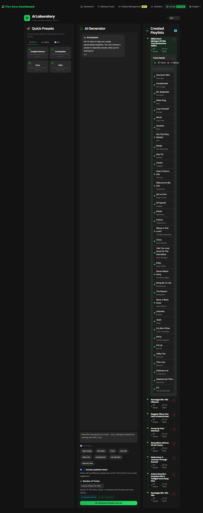

# Plex Sync & Completer


A comprehensive Python application, executed via Docker, that keeps your Plex music library synchronized with streaming services like Spotify and Deezer. Features automatic missing track downloads, AI-generated playlists with Google Gemini, and complete playlist management automation.

## ✨ Key Features

- **🎵 Multi-Platform Synchronization**: Automatically syncs playlists from **Spotify** and **Deezer** to your Plex library
- **👥 Multi-User Management**: Supports multiple Plex users with individual configurations and playlists
- **🤖 AI Playlist Generation**: Uses **Google Gemini** to create personalized weekly playlists and refresh existing AI playlists
- **🔍 Smart Missing Track Detection**: Identifies songs missing from your library with advanced matching algorithms
- **⬬ Automatic Downloads**: Uses **streamrip** to download missing tracks from Deezer automatically
- **🗑️ Automated Cleanup**: Removes old playlists while preserving important ones with protection tags
- **⏰ Background Processing**: Runs continuously with configurable sync intervals
- **📊 Rich Statistics**: Real-time dashboard with detailed music library analytics
- **🌍 Multilingual Interface**: Complete English/Italian support with automatic language detection

## 🌐 Internationalization

The application features a complete bilingual interface supporting both **English** and **Italian** languages:

### Language Features
- **Automatic Detection**: The interface automatically detects the user's preferred language from browser settings
- **Manual Switching**: Users can manually switch between languages using the language selector
- **Complete Translation**: All interface elements are translated including:
  - Dashboard and navigation menus
  - Chart labels and statistics
  - AI assistant messages and prompts
  - Error messages and notifications
  - Form placeholders and buttons

### How Language Switching Works
- **Session-Based**: Language preference is stored in the user's session
- **Dynamic Charts**: All statistical charts (genre distribution, artist rankings, etc.) update their labels based on the selected language
- **AI Integration**: The AI assistant adapts its responses and suggestions to the selected language
- **Real-Time**: Language changes take effect immediately without requiring a page refresh

The language system is powered by a custom i18n service with JSON-based translation files located in `plex_playlist_sync/translations/`.

## 🚀 Quick Start Guide

This section provides step-by-step instructions for beginners to get the system running with minimal configuration.

### Prerequisites

Before starting, ensure you have:

- ✅ **Docker Desktop** installed ([Download here](https://www.docker.com/products/docker-desktop/))
- ✅ **Plex Media Server** running and accessible ([Setup guide](https://support.plex.tv/articles/200288896-basic-setup/))
- ✅ A **music library** already configured in Plex
- ✅ Basic knowledge of your system's file paths

### Step 1: Get Required API Credentials

You'll need to obtain several API keys and tokens:

#### 🎵 Spotify API (Required for Spotify sync)
1. Go to [Spotify for Developers](https://developer.spotify.com/dashboard)
2. Click "Create App"
3. Fill in app name and description (any values work)
4. Note down your **Client ID** and **Client Secret**

#### 🎧 Deezer ARL (Required for downloads)
1. Log into [Deezer](https://www.deezer.com) in your browser
2. Open Developer Tools (F12)
3. Go to **Application** > **Cookies** > **deezer.com**
4. Find the cookie named `arl` and copy its value
5. **Important**: This token expires every few months and needs renewal

#### 🤖 Google Gemini API (Required for AI playlists)
1. Visit [Google AI Studio](https://aistudio.google.com/)
2. Click "Get API Key" and create a new project
3. Generate and copy your API key

#### 🎬 Plex Token (Required)
1. Open Plex in your browser
2. Go to **Settings** > **Account** > **Privacy**
3. Click "Show" next to "Plex Token" and copy the value

### Step 2: Download and Configure Files

#### Download Required Files
```bash
# Create project directory
mkdir plex-completer
cd plex-completer

# Download the example files (you'll need to get these from the repository)
# .env.example
# config.example.toml
# docker-compose.yml
```

#### Create Your Configuration Files

**📝 Create `.env` file** (copy from `.env.example`):
```bash
cp .env.example .env
```

Edit `.env` with your favorite text editor and fill in these **REQUIRED** values:
```bash
# Plex Configuration (REQUIRED)
PLEX_URL=http://your-plex-server-ip:32400
PLEX_TOKEN=your_plex_token_here
LIBRARY_NAME=Music

# Spotify Configuration (REQUIRED for Spotify sync)
SPOTIFY_CLIENT_ID=your_spotify_client_id
SPOTIFY_CLIENT_SECRET=your_spotify_client_secret

# AI Configuration (REQUIRED for AI playlists)
GEMINI_API_KEY=your_gemini_api_key

# Deezer Configuration (REQUIRED for downloads)
DEEZER_ARL=your_deezer_arl_cookie

# Basic Settings
PUID=1000
PGID=1000
```

**📝 Create `config.toml` file** (copy from `config.example.toml`):
```bash
cp config.example.toml config.toml
```

The main setting to configure in `config.toml`:
```toml
[deezer]
arl = "your_deezer_arl_cookie_here"
```

### Step 3: Configure Docker Compose

Edit `docker-compose.yml` and update the music path:

```yaml
services:
  completer:
    image: lelus78/plex-library-completer:latest
    container_name: plex-library-completer
    env_file:
      - .env
    ports:
      - "5000:5000"
    volumes:
      - /path/to/your/music:/music  # 👈 UPDATE THIS PATH
      - ./state_data:/app/state_data
      - ./config.toml:/root/.config/streamrip/config.toml
      - ./.env:/app/.env
    environment:
      - PUID=1000
      - PGID=1000
    restart: unless-stopped
```

**Path Examples by Operating System:**
- **Linux**: `/home/username/Music:/music`
- **Windows**: `C:\Users\YourName\Music:/music`
- **macOS**: `/Users/yourname/Music:/music`
- **NAS**: `/mnt/nas/Music:/music`

### Step 4: Launch the Application

```bash
# Start the container
docker-compose up -d

# Check if it's running
docker-compose logs -f
```

### Step 5: Access the Web Interface

Open your browser and go to:
- **Local**: `http://localhost:5000`
- **Network**: `http://[your-server-ip]:5000`

### Step 6: Initial Setup in Web Interface

1. **Index Your Library**: Click "Index Library" to scan your music collection
2. **Wait for Completion**: This may take 10-30 minutes depending on library size
3. **Configure Playlists**: Add your Spotify/Deezer playlist IDs in the `.env` file
4. **Test Sync**: Click "Start Full Sync" to test the synchronization

### Quick Test Configuration

For testing purposes, you can use this minimal `.env` configuration:

```bash
# Minimal test configuration
PLEX_URL=http://192.168.1.100:32400
PLEX_TOKEN=your_plex_token
LIBRARY_NAME=Music
SPOTIFY_CLIENT_ID=your_spotify_id
SPOTIFY_CLIENT_SECRET=your_spotify_secret

# Optional for full functionality
GEMINI_API_KEY=your_gemini_key
DEEZER_ARL=your_deezer_arl

# Disable features for testing
SKIP_SPOTIFY_SYNC=0
SKIP_DEEZER_SYNC=0
RUN_DOWNLOADER=0
RUN_GEMINI_PLAYLIST_CREATION=0
TEST_MODE_RUN_ONCE=1
```

## 📋 Required Files Checklist

Before running, ensure you have created these files:

- [ ] `.env` (from `.env.example` with your credentials)
- [ ] `config.toml` (from `config.example.toml` with your Deezer ARL)
- [ ] `docker-compose.yml` (with correct volume paths)
- [ ] Created `state_data/` directory (will be created automatically)

## 🔧 Advanced Configuration

### Understanding Configuration Files

The application uses two main configuration files:

### `.env.example` File
This file contains all the environment variables needed for the application. It includes:
- **Plex Server Configuration**: URL, tokens, and library settings
- **Streaming Service APIs**: Spotify and Deezer credentials
- **AI Integration**: Google Gemini API key
- **Operational Settings**: Sync intervals, cleanup rules, feature toggles

**Key sections in `.env.example`:**
```bash
# Plex Server Settings
PLEX_URL=http://your-plex-server:32400
PLEX_TOKEN=your_plex_token_here

# Streaming Services
SPOTIFY_CLIENT_ID=your_spotify_client_id
DEEZER_PLAYLIST_ID=123456789,987654321

# AI Features
GEMINI_API_KEY=your_gemini_api_key
PLEX_FAVORITES_PLAYLIST_ID_MAIN=12345

# Operational Settings
SECONDS_TO_WAIT=86400
RUN_DOWNLOADER=1
RUN_GEMINI_PLAYLIST_CREATION=1
```

### `config.example.toml` File
This is the configuration file for `streamrip` (the download engine). The most important setting is:
```toml
[deezer]
arl = "your_deezer_arl_token_here"
```

**How to get your Deezer ARL:**
1. Log into Deezer in your browser
2. Open Developer Tools (F12)
3. Go to Application/Storage > Cookies
4. Find the `arl` cookie value
5. Copy this value to the config file

### Alternative Installation Methods

#### 🐳 Docker Run Command (Single Command)

For quick testing without docker-compose:

```bash
docker run -d \
  --name plex-library-completer \
  -p 5000:5000 \
  -v /path/to/your/music:/music \
  -v ./state_data:/app/state_data \
  -v ./config.toml:/root/.config/streamrip/config.toml \
  -v ./.env:/app/.env \
  -e PUID=1000 \
  -e PGID=1000 \
  --restart unless-stopped \
  lelus78/plex-library-completer:latest
```

#### 🔧 Portainer Deployment

If you use Portainer for Docker management:

1. **Create New Stack**:
   - Go to Portainer → Stacks → Add Stack
   - Name it `plex-library-completer`

2. **Upload Configuration**:
   - Choose "Upload" method
   - Upload your `docker-compose.yml` file

3. **Environment Variables**:
   - Upload your `.env` file or manually add variables

4. **Deploy and Monitor**:
   - Click "Deploy the stack"
   - Monitor logs in Containers section

#### 🔧 Build from Source (Development)

If you want to modify the code or build locally:

1.  **Clone the Repository**
    ```bash
    git clone <YOUR_PRIVATE_REPOSITORY_URL>
    cd Plex-Library-Completer
    ```

2.  **Configure Environment Variables**
    Copy and customize the environment file:
    ```bash
    cp .env.example .env
    ```
    Edit `.env` with your preferred text editor and fill in all the required values according to the Environment Variables table below.

3.  **Configure Deezer Downloads (Optional)**
    To enable automatic track downloads from Deezer, you have two options:
    
    **Option A: Environment Variable (Recommended for Docker)**
    Add your ARL cookie to the `.env` file:
    ```bash
    DEEZER_ARL=your_arl_cookie_here
    ```
    
    **Option B: Configuration File (Legacy method)**
    Copy and customize the streamrip configuration:
    ```bash
    cp config.example.toml config.toml
    ```
    Edit `config.toml` and add your Deezer ARL token.
    
    To find your Deezer ARL cookie, follow the instructions at:
    https://github.com/nathom/streamrip/wiki/Finding-your-Deezer-ARL-Cookie
    
    **Note**: If neither option is configured, the application will still work but will skip automatic downloads and only show links for manual download.

4.  **Verify Volume Paths**
    Edit `docker-compose.yml` and update the music library path:
    ```yaml
    volumes:
      - /path/to/your/music:/music # <-- Update this path
      # ... other volumes
    ```

#### Method 2: Portainer Installation

If you're using Portainer for Docker management:

1.  **Prepare Configuration Files**
    Create a folder on your server (e.g., `/opt/plex-completer/`) and place:
    - Your configured `.env` file (copied from `.env.example`)
    - Your configured `config.toml` file (copied from `config.example.toml`)
    - The `docker-compose.yml` file

2.  **Create Stack in Portainer**
    - Go to Portainer > Stacks > Add Stack
    - Choose "Upload" method
    - Upload your `docker-compose.yml` file
    - In the "Environment variables" section, either:
      - Upload your `.env` file, OR
      - Manually add each environment variable

3.  **Configure Volumes**
    In the docker-compose.yml, ensure paths are correct for your server:
    ```yaml
    volumes:
      - /opt/plex-completer/.env:/app/.env
      - /opt/plex-completer/config.toml:/root/.config/streamrip/config.toml
      - /path/to/your/music:/music
      - ./state_data:/app/state_data
    ```

4.  **Deploy Stack**
    - Review your configuration
    - Click "Deploy the stack"
    - Monitor logs in Portainer to ensure everything starts correctly

#### Method 3: Portainer with Git Repository

For easier updates:

1.  **Create Stack from Git**
    - Go to Portainer > Stacks > Add Stack
    - Choose "Repository" method
    - Enter your repository URL
    - Set the Compose path to `docker-compose.yml`

2.  **Environment Configuration**
    - In Portainer, add all environment variables manually, OR
    - Pre-place your `.env` file in the repository (not recommended for security)

3.  **Additional Configuration**
    - Ensure `config.toml` is accessible to the container
    - Set up volume mappings for your music library

## 🖥️ Cross-Platform Setup

Volume paths vary by host system. After copying `.env.example` and `config.example.toml`
to their real names, mount them so the container can read them. Both `app.py` and
`plex_playlist_sync/sync_logic.py` look for `/app/.env`.

### Linux
```yaml
volumes:
  - /home/youruser/Music:/music
  - ./config.toml:/root/.config/streamrip/config.toml
  - ./state_data:/app/state_data
  - ./your.env:/app/.env
```

### Windows (Docker Desktop)
Use the Docker Desktop path style.
```yaml
volumes:
  - /c/Users/YourUser/Music:/music
  - ./config.toml:/root/.config/streamrip/config.toml
  - ./state_data:/app/state_data
  - ./your.env:/app/.env
```

### NAS Share
Mount the share on the host and reference the mount point.
```yaml
volumes:
  - /mnt/nas/Music:/music
  - ./config.toml:/root/.config/streamrip/config.toml
  - ./state_data:/app/state_data
  - ./your.env:/app/.env
```

### ▶️ Execution

#### Docker Compose (Command Line)

To start the container in the background:
```bash
docker-compose up -d --build
```
The `--build` flag is recommended the first time or after code changes.

To view logs in real time:
```bash
docker-compose logs -f
```

To stop the container:
```bash
docker-compose down
```

#### Portainer

If using Portainer:
1. **Start**: Click the "Start" button on your stack in Portainer
2. **View Logs**: Go to Containers > [container-name] > Logs for real-time monitoring
3. **Stop**: Click the "Stop" button on your stack
4. **Update**: Use "Pull and redeploy" to update the container with new images
5. **Restart**: Use the "Restart" button to restart the stack after configuration changes

#### Web Interface

Once running, access the web interface at:
- **Local**: `http://localhost:5000`
- **Network**: `http://[your-server-ip]:5000`

The interface provides:
- Dashboard with sync status and statistics
- Missing tracks management
- AI playlist laboratory
- Detailed music statistics and charts

## Environment Variables (`.env`)

This is the complete list of variables to configure in the `.env` file.

| Variable                       | Description                                                                                              | Example                                       | Required |
| ------------------------------- | -------------------------------------------------------------------------------------------------------- | --------------------------------------------- | -------- |
| `PLEX_URL`                      | URL of your Plex server                                                                                | `http://192.168.1.10:32400`                   | ✅ |
| `PLEX_TOKEN`                    | Access token for the main Plex user                                                                    | `yourPlexTokenHere`                           | ✅ |
| `LIBRARY_NAME`                  | Exact name of your music library on Plex                                                               | `Music` or `Musica`                           | ✅ |
| `SPOTIFY_CLIENT_ID`             | Client ID obtained from Spotify for Developers dashboard                                              | `yourSpotifyClientID`                         | ✅ |
| `SPOTIFY_CLIENT_SECRET`         | Client Secret obtained from Spotify for Developers dashboard                                          | `yourSpotifyClientSecret`                     | ✅ |
| `PUID`                          | User ID that the container should run as                                                           | `1000`                                        | ✅ |
| `PGID`                          | Group ID that the container should run as                                                          | `1000`                                        | ✅ |
| `PLEX_TOKEN_USERS`              | Access token for the secondary Plex user (optional)                                                    | `secondaryUserPlexToken`                      | ❌ |
| `DEEZER_PLAYLIST_ID`            | Numeric IDs of Deezer playlists to sync for the main user, comma-separated                           | `12345678,87654321`                           | ❌ |
| `DEEZER_PLAYLIST_ID_SECONDARY`  | Deezer playlist IDs for the secondary user, comma-separated (optional)                               | `98765432`                                    | ❌ |
| `SPOTIFY_PLAYLIST_IDS`          | Spotify playlist IDs to sync for main user, comma-separated                                          | `37i9dQZEVXcJZyENOWUFo7,3J9M8N6y6vSO8Ex3rR7PJM` | ❌ |
| `GEMINI_API_KEY`                | API key obtained from Google AI Studio for AI functions                                              | `yourGeminiApiKey`                            | ❌ |
| `PLEX_FAVORITES_PLAYLIST_ID_MAIN` | Rating Key (numeric ID) of the "favorites" Plex playlist for the main user (for AI)                 | `12345`                                       | ❌ |
| `PLEX_FAVORITES_PLAYLIST_ID_SECONDARY` | Rating Key of the "favorites" playlist for the secondary user (optional, for AI)                   | `54321`                                       | ❌ |
| `DEEZER_ARL`                    | Deezer ARL cookie for downloading tracks (optional). Leave empty to skip downloads                  | `your_arl_cookie_here`                        | ❌ |
| `SECONDS_TO_WAIT`               | Seconds to wait between synchronization cycles                                                        | `86400` (24 hours)                            | ❌ |
| `WEEKS_LIMIT`                   | Number of weeks after which old playlists are deleted                                                 | `4`                                           | ❌ |
| `PRESERVE_TAG`                  | If this text is in a playlist title, it will not be deleted                                          | `NO_DELETE`                                   | ❌ |
| `SKIP_SPOTIFY_SYNC`             | Set to `1` to disable Spotify synchronization                                                        | `0` (enabled)                                 | ❌ |
| `SKIP_DEEZER_SYNC`              | Set to `1` to disable Deezer synchronization                                                         | `0` (enabled)                                 | ❌ |
| `RUN_DOWNLOADER`                | Set to `1` to enable automatic download of missing tracks                                            | `1` (enabled)                                 | ❌ |
| `RUN_GEMINI_PLAYLIST_CREATION`  | Set to `1` to enable weekly AI playlist creation                                                     | `1` (enabled)                                 | ❌ |
| `AUTO_DELETE_AI_PLAYLIST`       | Set to `1` to auto-delete old AI playlists                                                           | `1` (enabled)                                 | ❌ |
| `TEST_MODE_RUN_ONCE`            | Set to `1` to run only one sync cycle (for testing)                                                  | `0` (disabled)                                | ❌ |

## Project Structure

```
Plex-Library-Completer/
├── .env                  # Your secret environment variables
├── .gitignore            # Files and folders to ignore for Git
├── config.toml           # Streamrip configuration (e.g. ARL)
├── docker-compose.yml    # Docker orchestration file
├── Dockerfile            # Instructions to build the image
├── README.md             # This file
├── requirements.txt      # Python dependencies
│
└── plex_playlist_sync/   # Application source code
    ├── run.py
    └── utils/
        ├── cleanup.py
        ├── deezer.py
        ├── downloader.py
        └── ...
```

## 🔧 Troubleshooting

### Common Issues and Solutions

#### ❌ "File di log non ancora creato" (Log file not created)
**Cause**: Log file path is incorrect or permissions issue
**Solution**: 
- Ensure the container has write permissions to `/app/logs/`
- Check that `PUID` and `PGID` are set correctly in your `.env`

#### ❌ "Tracce Sincronizzate" stuck at 5000
**Cause**: Using old version or cache issue
**Solution**:
- Update to latest image: `docker-compose pull && docker-compose up -d`
- Clear application cache and restart container

#### ❌ "Permission denied" when downloading
**Cause**: Music directory permissions issue
**Solution**:
```bash
# Fix permissions on music directory
sudo chown -R 1000:1000 /path/to/your/music
# Or use your user ID
sudo chown -R $(id -u):$(id -g) /path/to/your/music
```

#### ❌ Spotify/Deezer sync not working
**Cause**: Sync might be disabled in environment variables
**Solution**: Check your `.env` file:
```bash
SKIP_SPOTIFY_SYNC=0  # 0 = enabled, 1 = disabled
SKIP_DEEZER_SYNC=0   # 0 = enabled, 1 = disabled
```

#### ❌ AI playlists not updating
**Cause**: Missing Gemini API key or favorites playlist ID
**Solution**:
- Verify `GEMINI_API_KEY` is set and valid
- Set `PLEX_FAVORITES_PLAYLIST_ID_MAIN` to a valid playlist ID
- Enable AI playlist creation: `RUN_GEMINI_PLAYLIST_CREATION=1`

#### ❌ Container won't start
**Cause**: Configuration file errors or volume mount issues
**Solution**:
```bash
# Check container logs
docker logs plex-library-completer

# Verify file exists and is readable
ls -la .env config.toml

# Test docker-compose syntax
docker-compose config
```

### Configuration Validation

Before starting the container, validate your setup:

```bash
# Check required environment variables are set
echo "Checking .env file..."
required_vars=("PLEX_URL" "PLEX_TOKEN" "LIBRARY_NAME" "SPOTIFY_CLIENT_ID" "SPOTIFY_CLIENT_SECRET")
for var in "${required_vars[@]}"; do
    if grep -q "^${var}=" .env; then
        echo "✅ $var is set"
    else
        echo "❌ $var is missing"
    fi
done

# Validate TOML syntax
python3 -c "import toml; toml.load('config.toml'); print('✅ config.toml syntax is valid')" 2>/dev/null || echo "❌ config.toml has syntax errors"

# Check if Plex is accessible
curl -s "$PLEX_URL/status" || echo "❌ Cannot reach Plex server"
```

### Performance Optimization

For large music libraries (>50,000 tracks):

```bash
# In your .env file, add these optimizations:
# Index in smaller batches
PLEX_INDEX_BATCH_SIZE=1000

# Reduce concurrent operations  
MAX_CONCURRENT_DOWNLOADS=2

# Enable test mode for initial setup
TEST_MODE_RUN_ONCE=1
TEST_MODE_PLAYLIST_LIMIT=5
```

### Getting Help

If you're still having issues:

1. **Check Logs**: Always start by checking container logs
   ```bash
   docker logs plex-library-completer --tail 50
   ```

2. **Validate Configuration**: Use the validation commands above

3. **Test Components**: Test each service independently:
   - Plex: Access your Plex web interface
   - Spotify: Test your API credentials at [Spotify Console](https://developer.spotify.com/console/)
   - Deezer: Verify your ARL cookie hasn't expired

4. **Common File Locations**:
   - Container logs: `/app/logs/plex_sync.log`
   - Database: `/app/state_data/sync_database.db`
   - Config files: `/app/.env`, `/root/.config/streamrip/config.toml`

## 🆕 Latest Features

### AI Playlist Auto-Refresh (New!)
- **Automatic Updates**: AI-generated playlists like "Reggae Vibes" now automatically refresh with new content from your library
- **Smart Regeneration**: Maintains original theme while adding fresh tracks
- **Manual & Automatic**: Works during both manual syncs and scheduled automatic syncs
- **Weekly Management**: Weekly AI playlists are separately managed with their own persistence system

### Enhanced Synchronization
- **Real-time Stats**: Dashboard shows actual track counts instead of hardcoded values
- **Improved Logging**: Fixed log display in web interface with proper file paths
- **Permission Handling**: Better container permissions management for downloads
- **Multi-user Support**: Separate AI playlist management for main and secondary users

### Performance Improvements
- **Faster Indexing**: Optimized library scanning with batch processing
- **Smart Matching**: Advanced track matching algorithms reduce false positives
- **Concurrent Operations**: Parallel processing for API calls and downloads
- **Database Optimization**: Improved SQLite performance with proper indexing

## 📸 Screenshots

### Main Dashboard


### Missing Tracks Management


### Detailed Statistics


### AI Playlist Laboratory


---

## 📄 License

This project is licensed under the MIT License - see the [LICENSE](LICENSE) file for details.

## 🤝 Contributing

Contributions are welcome! Please feel free to submit a Pull Request.

## ⭐ Star History

If this project helps you, please consider giving it a star! ⭐